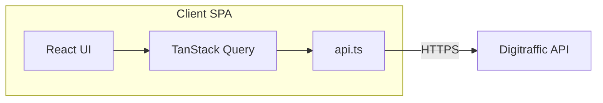

# Train Punctuality Tracker – Technical Solutions Spec

## Overview & references

This document describes **how** to implement the Train Punctuality Tracker: tech stack, architecture, data flow, API usage, deployment, and testing. It does not repeat product or UX requirements; those are defined in the functional and visual specifications.

**Functional specification:** [FUNCTIONAL-SPEC.md](FUNCTIONAL-SPEC.md)  
**Visual specification:** [VISUAL-SPEC.md](VISUAL-SPEC.md)

The application is a client-only React SPA that tracks punctuality of two commuter trains (Lempäälä ↔ Tampere) using the Digitraffic Railway Traffic API. It provides summary statistics, a day-by-day timeline, and a sortable detail table. All behaviour and acceptance criteria are defined in the functional spec; visual design is in the visual spec. This document focuses on technical implementation.

---

## Tech stack

| Technology | Purpose |
| ---------- | ------- |
| **Vite** | Build tool and dev server |
| **React 19** | UI framework |
| **TypeScript** | Typing and tooling |
| **Mantine** | UI components and theming. Use at least `@mantine/core` and `@mantine/dates` (for date inputs). Implement visual spec with Mantine components and theme. |
| **TanStack Query (React Query) 5** | Server state, caching, and data fetching for Digitraffic API |
| **dayjs** | Date/time manipulation with UTC and timezone plugins (`Europe/Helsinki`) |
| **@tabler/icons-react** | Icons (search, chart, table, alert, inbox) |
| **@mantine/dates** | Date input components |

- No backend; the app runs entirely in the browser and calls Digitraffic directly.
- Styling and layout follow the visual spec (colors, cards, table, timeline) using Mantine's component library and theme (e.g. Mantine colors for green/yellow/red/gray status and lime/cyan backgrounds for train cards).

---

## Architecture



- **SPA**: Single-page application; no server-side rendering or API proxy.
- **Data flow**: User selects date range and clicks "Fetch" → (1) compute weekdays in range (end not in future); (2) for each (date, trainNumber) in that set, determine if an API call is needed: **yes** if date is today, or if date is not today and there is no valid data in local storage for that (date, trainNumber); (3) **needed API calls** = number of such pairs; if **> 30**, set an error (e.g. "Too many API calls") and **do not** call the API; if **≤ 30**, proceed to fetch only for those pairs that need it and use local storage for the rest → `api.ts` performs `GET https://rata.digitraffic.fi/api/v1/trains/{date}/{trainNumber}` when needed → responses are parsed into `TrainRecord` → successful results for **past dates only** are written to local storage → Query cache holds the data → Summary (cards + timelines) and Table views read from the same hook output.
- **State**: All Digitraffic-derived data is **server state** managed by TanStack Query, with **local storage** as a persistence layer for past dates. UI state (selected date range, active tab) stays in React state (e.g. `useState` in the top-level component or a small context if preferred). There are two tabs: Summary and Table; the Summary tab shows both summary cards and day-by-day timelines in one panel.

---

## Data layer (TanStack Query)

### Query key design

Use a stable query key per train per date so cache is deduplicated and reusable:

```typescript
const trainQueryKey = (date: string, trainNumber: number) =>
  ['train', date, trainNumber] as const;
```

- **Example:** `['train', '2026-01-27', 1719]` for the morning train on that date.

### Batching and aggregation

- For a given date range (start, end), compute the list of **weekdays only** (Monday–Friday, end date not in future). Then compute **needed API calls** from this list and local storage: each (date, trainNumber) not satisfied from storage, or today, counts as 1. If needed API calls **> 30**, abort with error and do not fetch. If **≤ 30**, for each (date, trainNumber) that needs data, call API (or read from storage), then aggregate.
- For each (date, trainNumber) that requires an API call, either:
  - use **`useQueries`** to run multiple queries in parallel, or
  - use a single hook that calls `queryClient.fetchQuery` (or `prefetchQuery`) for each `(date, trainNumber)` when the user clicks “Fetch”.
- Show a **loading** state until all queries for the selected range have settled (success or skipped).
- **Aggregate** successful results: map each API response to one `TrainRecord` (see API integration below), collect into a single `TrainRecord[]`, sort by date (newest first) for the table. Return `{ data: TrainRecord[], isLoading, error }` from the hook (e.g. `useTrainData(startDate, endDate)`).
- **Cache and stale time**: Set `staleTime` (e.g. 5–15 minutes) so the same date/train is not re-fetched on every tab switch; historical data is effectively immutable.

### Local storage

- **Purpose**: Persist fetched train data in the browser so repeat visits or re-fetches for the same date range avoid unnecessary API calls.
- **Key format**: Use a stable key per (date, trainNumber), e.g. `train:{date}:{trainNumber}` (e.g. `train:2026-01-27:1719`). Store the parsed **TrainRecord** (or the raw API response if you parse on read) as JSON.
- **Read**: When resolving data for (date, trainNumber), if **date is not today** (compare as YYYY-MM-DD in Finnish timezone), check `localStorage.getItem(key)` first. If present and valid, use it and do not call the API. If **date is today**, skip local storage and always fetch from the API.
- **Write**: After a successful API fetch, parse to TrainRecord; then **only if date is not today**, call `localStorage.setItem(key, JSON.stringify(trainRecord))`. Never write today’s data to local storage.
- **Placement**: Implement the read/write in the same layer that triggers the API (e.g. inside the TanStack Query fetcher or in a thin wrapper around `fetchTrain`). The hook calls a function that: (1) if date === today → fetch from API, do not persist; (2) else check localStorage → if hit, return parsed data; (3) else fetch from API, then persist and return.

### Needed API calls helper

- **`getNeededApiCalls(startDate: string, endDate: string, trainNumbers: TrainNumbers): number`** — Takes the date range (ISO YYYY-MM-DD) and the two train numbers (selected outbound and return) as a `TrainNumbers` tuple `[number, number]`. Computes the list of weekdays only (end not in future), and returns the number of (date, trainNumber) pairs that would require an API call: for each weekday in range and each of the two train numbers, count 1 if date is today (Finnish timezone) or if there is no valid data in local storage for that (date, trainNumber). The hook calls this reactively (not just on fetch); if the result is > 30, sets `tooManyApiCalls: true` and disables the Fetch button; if ≤ 30, proceeds with fetch. When no route data exists, use default train numbers (1719, 9700).
- **`getApiCallsNeeded(startDate, endDate, trainNumbers): Array<{date, trainNumber}>`** — Like `getNeededApiCalls` but returns the actual list of pairs that need API calls (used internally by the hook to know which requests to make).
- **`getCachedData(startDate, endDate, trainNumbers): TrainRecord[]`** — Returns all cached records from localStorage for the given range and train numbers (excludes today). Used after API fetch to merge with fresh results for completeness.

### Hook contract

- **`useTrainData(startDate: string, endDate: string, trainNumbers: TrainNumbers)`**:
  - **When it runs:** Queries run only when the user has triggered a fetch by calling the returned `fetch()` function. Before that, return empty data; use an `enabled` option so TanStack Query does not run until fetch is requested.
  - **Input:** ISO date strings (YYYY-MM-DD), weekday-only, end not in future, and the two selected train numbers as `TrainNumbers` (a `[number, number]` tuple). The hook computes **needed API calls** from the range, local storage, and these train numbers via `getNeededApiCalls(startDate, endDate, trainNumbers)`; if > 30, sets `tooManyApiCalls: true` and does not fetch.
  - **Output:** `{ data: TrainRecord[], isLoading: boolean, error: Error | null, tooManyApiCalls: boolean, neededApiCalls: number, fetch: () => void, hasFetched: boolean }`. The `hasFetched` flag tracks whether the user has clicked Fetch at least once (used by the UI to distinguish initial state from empty results). The `tooManyApiCalls` flag is derived from the current date range and storage state (reactive, not only set on fetch).
  - **Internally:** A single `useQuery` with `enabled` gated by fetch state. When `fetch()` is called, the hook creates a `fetchState` object (startDate, endDate, trainNumbers, fetchId) that triggers the query. The query function calls `getApiCallsNeeded()` to get the list of (date, trainNumber) pairs, then `Promise.all` fetches them in parallel. Each pair first checks localStorage cache (for non-today dates); on miss, calls `fetchTrain()` and parses via `parseTrainResponseWithStations()` using station codes derived from direction. After fetching, merges with `getCachedData()` to ensure completeness. Results sorted by date descending (newest first). Error is set only if **all** requests fail and no results exist. `staleTime` is 5 minutes; `retry: 1`.

---

## API integration

### API reference (Digitraffic Railway Traffic API)

- **Base URL:** `https://rata.digitraffic.fi/api/v1`
- **Endpoint:** `GET /trains/{departure_date}/{train_number}` (e.g. `GET /trains/2026-01-30/1719`)
- **Train numbers:** Morning 8:20 LPÄ→TPE: `1719`; Evening 16:35 TPE→LPÄ: `9700`
- **Station codes:** Lempäälä `LPÄ`, Tampere `TPE`
- **Response:** JSON array with a single train object. All times UTC; Finland is UTC+2/UTC+3. Historical data ~720 days.

```typescript
interface TrainResponse {
  trainNumber: number;
  departureDate: string;        // "YYYY-MM-DD"
  trainType: string;
  operatorShortCode: string;
  runningCurrently: boolean;
  cancelled: boolean;
  timeTableRows: TimeTableRow[];
}

interface TimeTableRow {
  stationShortCode: string;
  type: "DEPARTURE" | "ARRIVAL";
  scheduledTime: string;        // ISO 8601 UTC
  actualTime?: string;
  differenceInMinutes?: number; // positive = late
  commercialStop: boolean;
  cancelled: boolean;
}
```

**Example API calls:**

```bash
curl 'https://rata.digitraffic.fi/api/v1/trains/2026-01-30/1719' --compressed
curl 'https://rata.digitraffic.fi/api/v1/trains/2026-01-30/9700' --compressed
```

### Client

- **Single function** in `src/utils/api.ts`:  
  `fetchTrain(date: string, trainNumber: number): Promise<TrainResponse | null>`  
  - Calls `GET https://rata.digitraffic.fi/api/v1/trains/{date}/{trainNumber}`.
  - Returns the first element of the JSON array (one train per response), or `null` if the response is empty or the train is missing.
  - Throws on network errors or non-OK HTTP status so TanStack Query can treat them as errors and optionally retry.
- **Local storage** is not inside `fetchTrain`; the **caller** (e.g. the TanStack Query fetcher or a wrapper in the hook) is responsible for: (1) checking localStorage for past dates and returning early if data exists; (2) calling `fetchTrain` when no cached data or when date is today; (3) after a successful fetch, writing to localStorage only when date is not today (using a key like `train:{date}:{trainNumber}` and storing TrainRecord or raw response as JSON).

### One-time GraphQL route fetch

- **Purpose:** Fetch train numbers, station name, scheduled departure times, and direction for the **Lempäälä–Tampere** route for the current day (one-time background fetch; not the main "Fetch Data" flow). Only trains that **stop at Lempäälä** (trainStopping true at Lempäälä) are stored; both directions (Lempäälä → Tampere and Tampere → Lempäälä) are included.
- **When it runs:** Once on app load, triggered from `App.tsx`, guarded by a ref so it runs at most once per load (avoids double run under React Strict Mode).
- **Endpoint:** `POST https://rata.digitraffic.fi/api/v2/graphql/graphql` with `Content-Type: application/json`, `Accept-Encoding: gzip`.
- **Filter:** A **single** query. Filter by **station name** "Lempäälä": `where: { timeTableRows: { contains: { station: { name: { equals: "Lempäälä" } } } } }`. The API returns all trains that have a timeTableRow at Lempäälä (both directions); no second query for Tampere.
- **Query fields (minimal):** `trainNumber`, `trainType { name }`, and `timeTableRows(where: ...) { type, scheduledTime, station { name }, trainStopping }`. Do not request `departureDate` or `station.shortCode`/`uicCode`. **Response size:** Use `timeTableRows(where: { or: [{ station: { name: { equals: "Lempäälä" } } }, { station: { name: { equals: "Tampere asema" } } }] })` so the server returns only rows for Lempäälä and Tampere asema; this reduces payload size.
- **Parsing:** Filter out trains that do **not** stop at Lempäälä: keep only trains that have at least one timeTableRow at Lempäälä (station name "Lempäälä") with `trainStopping === true`. For each remaining train, determine the **departure station** by comparing the two DEPARTURE rows (Lempäälä and Tampere asema): the one with the **earlier** `scheduledTime` is the train’s departure on this route segment. From that, derive the **direction** (e.g. Lempäälä → Tampere if Lempäälä departure is earlier, otherwise Tampere → Lempäälä). Produce one stored record per train with train number, departure station name, scheduled departure time, and direction (or equivalent field).
- **Train type filter:** Only commuter and long-distance train types are included. Allowed types: `HL`, `HV`, `HLV`, `H`, `PVS`, `P`, `HDM`, `PVV`, `S`, `V`, `IC2`, `IC`, `HSM`, `AE`, `PYO`, `MV`, `MUS` (source: Digitraffic `/api/v1/metadata/train-types`, categories "Commuter" and "Long-distance"). Trains with other types (e.g. shunting, test) are excluded.
- **Storage:** Key `train:route:weekday`, value `{ date: string, trains: RouteTrainInfo[] }`. `RouteTrainInfo` includes `trainNumber`, `stationName` (departure station), `scheduledDeparture`, and `direction` (`"Lempäälä → Tampere"` | `"Tampere → Lempäälä"`). Only trains that stop at Lempäälä are stored (both directions). No full TrainRecord or full timeTableRows is stored.
- **Idempotence:** Per-day flag `train:route:fetched` set to today's date (Finnish timezone) after a successful fetch, so the fetch runs at most once per day; the ref in App ensures at most one in-flight run per load.
- **Error handling:** Silently fails (no UI notification, no throw) — the app falls back to default trains (1719, 9700).

### Train selection (route data for selects)

- **Reading route data:** Read from `localStorage.getItem("train:route:weekday")` via `getRouteWeekdayFromStorage()`. Parse as `RouteTodayStorage = { date: string, trains: RouteTrainInfo[] }`. Use this to populate the two train selects (outbound train, return train).
- **Splitting by direction:** Partition `trains` by `direction`: `direction === "Lempäälä → Tampere"` → outbound options; `direction === "Tampere → Lempäälä"` → return options. Sort each list by `scheduledDeparture` ascending.
- **Return-train filter:** For the return-train select, show only those return-direction trains whose `scheduledDeparture` is **greater than** the selected outbound train’s `scheduledDeparture` (compare as ISO strings or parsed dates). When the user changes the outbound selection, recompute the return list; if the currently selected return train is no longer in the filtered list, clear the selection or set it to the first valid return option (document chosen behaviour).
- **Selected train numbers for API/hook:** The two selected trains (outbound and return) supply the train numbers used for all subsequent data fetching. **`getNeededApiCalls`**, **`getApiCallsNeeded`**, **`getCachedData`**, and REST calls must use these two train numbers (e.g. passed as a parameter like `trainNumbers: [number, number]` or from shared state), not a fixed `[1719, 9700]`.
- **Defaults:** When no route data is available, use default train numbers 1719 (outbound) and 9700 (return). When route data exists, default outbound = train 1719 if present in the outbound list, otherwise first item; default return = train 9700 if present in the filtered return list, otherwise first item.

### Parsing to TrainRecord

- Map Digitraffic `TrainResponse` + `timeTableRows` to the functional spec’s **TrainRecord**:
  - Find the **departure** row: `type === "DEPARTURE"` and `stationShortCode === from` (LPÄ for 1719, TPE for 9700). Find the **arrival** row for the destination station.
  - **Delay:** Use `differenceInMinutes` from the departure row. If `differenceInMinutes` or `actualTime` is missing (e.g. train not yet departed), treat as `delayMinutes: 0` and derive status from that, or skip the record—document the choice. If train is cancelled (top-level or departure row), use status CANCELLED per functional spec.
- **Status classification** (functional spec):
  - `cancelled` → `CANCELLED`
  - else `delayMinutes <= 1` → `ON_TIME`
  - else `delayMinutes <= 5` → `SLIGHT_DELAY`
  - else → `DELAYED`
- Implement this parsing in a dedicated function (e.g. in `api.ts` or `utils/parseTrain.ts`) and reuse it wherever API response is turned into `TrainRecord`.

### Error handling

- **Per-query errors** (network failure, 5xx): Show an appropriate message in the UI; TanStack Query retry is optional (e.g. 1–2 retries).
- **Missing data**: If the API returns an empty array or no train for a date, treat as "no data" for that date/train (skip, do not fail the whole range). Do not show a fatal error for a single missing day.
- **Partial success**: When fetching a date range, some requests may succeed while others fail. The hook should:
  1. Return all successfully fetched `TrainRecord[]` in `data`.
  2. Set `error` only if **all** requests failed; otherwise leave `error` as `null`.
  3. Optionally expose a `partialErrors?: { date: string; trainNumber: number; error: Error }[]` field so the UI can show a warning like "Data for 2 days could not be loaded" without blocking the entire result.
  4. Never write failed responses to local storage; only successful responses for past dates are persisted.

---

## Project structure

Structure (aligned with functional spec; add TanStack Query, Mantine, and storage):

```
src/
├── components/
│   ├── DateRangePicker.tsx    # Date inputs + train selection dropdowns + fetch button
│   ├── SummaryCard.tsx        # Statistics card (on-time %, avg delay, progress bar)
│   ├── Timeline.tsx           # Color-coded grid of daily results
│   ├── DataTable.tsx          # Sortable results table
│   ├── TabNavigation.tsx      # Summary / Table tab switcher
│   └── StatusLegend.tsx       # Reusable color legend component
├── hooks/
│   └── useTrainData.ts        # Data fetching hook (cache check → API → merge → sort)
├── utils/
│   ├── api.ts                 # REST API: fetchTrain(), parseTrainResponse(), parseTrainResponseWithStations(), getTrainStatus()
│   ├── apiGraphql.ts          # GraphQL: route fetch, direction splitting, return filtering
│   ├── dateUtils.ts           # Finnish timezone dates, weekday ranges, formatting
│   ├── statsCalculator.ts     # computeSummary(), filterByTrain(), sortByDate()
│   ├── trainStorage.ts        # LocalStorage: get/set/cache check, API call counting (key train:{date}:{trainNumber})
│   └── trainUtils.ts          # getTrainTitle() display formatter
├── types/
│   └── train.ts               # TrainRecord, TrainResponse, TrainConfig, TrainSummary, TrainStatus, TRAINS
├── constants/
│   └── statusLegend.ts        # STATUS_LEGEND_ITEMS (4 status colors + labels)
├── test/
│   ├── setup.ts               # Vitest setup: jest-dom matchers, window.matchMedia polyfill
│   └── test-utils.tsx         # Custom render() wrapping MantineProvider
├── App.tsx                    # Main component: state, route fetch, train selection, layout
└── main.tsx                   # Entry: StrictMode → QueryClientProvider → MantineProvider → App
```

- **`src/types/train.ts`**: `TrainRecord`, `TrainResponse`, `TimeTableRow`, status type, and `TRAINS` config. The `TrainRecord` interface must match the functional spec exactly:
  ```typescript
  interface TrainRecord {
    date: string;                 // "YYYY-MM-DD"
    trainNumber: number;
    trainType: string;
    cancelled: boolean;
    scheduledDeparture: string;   // ISO timestamp
    actualDeparture: string | null;
    scheduledArrival: string;
    actualArrival: string | null;
    delayMinutes: number;
    status: "ON_TIME" | "SLIGHT_DELAY" | "DELAYED" | "CANCELLED";
  }
  ```
- **`src/utils/api.ts`**: `fetchTrain(date, trainNumber)` for REST API calls. Two parsing functions: `parseTrainResponse(response)` for default trains (uses known station codes for 1719/9700), and `parseTrainResponseWithStations(response, from, to)` for arbitrary trains on the route (used when user selects trains from dropdowns). Also exports `getTrainStatus(cancelled, delayMinutes)` for status classification and `getStationCodesByDirection(direction)` to map route direction to station codes (LPÄ/TPE).
- **`src/utils/dateUtils.ts`**: Weekdays in range, Finnish date format, conversion from UTC to Finnish time (`Europe/Helsinki`) for display; also helpers for "is today" and "reference weekday date" used by storage and route fetcher. Uses dayjs with UTC and timezone plugins.
  - **`formatFinnishDate(date: string): string`** — Takes ISO date (YYYY-MM-DD), returns Finnish weekday abbreviation + day.month, e.g. `"ma 27.1."`. Weekday abbreviations: `ma` (Mon), `ti` (Tue), `ke` (Wed), `to` (Thu), `pe` (Fri).
  - **`formatFinnishTime(isoTimestamp: string): string`** — Takes ISO timestamp, returns 24h time in Finnish timezone, e.g. `"08:20"`.
  - **`getDefaultDateRange(): { startDate, endDate }`** — Returns the last 14 calendar days as default range.
  - **`getReferenceWeekdayDate(): string`** — Returns today (Mon–Fri) or next Monday (on weekends), used for GraphQL route fetch.
- **`src/utils/trainStorage.ts`**: `getTrainFromStorage(date, trainNumber)` (returns `TrainRecord | null`, only for past dates; re-derives status from delay on read for classification consistency); `setTrainInStorage(date, trainNumber, record)` (no-op when date is today); `getNeededApiCalls(startDate, endDate, trainNumbers)` returns the count of API calls needed; `getApiCallsNeeded(startDate, endDate, trainNumbers)` returns the actual list of pairs; `getCachedData(startDate, endDate, trainNumbers)` returns all cached records. All functions take `trainNumbers: TrainNumbers` (a `[number, number]` tuple). Key format: `train:{date}:{trainNumber}`.
- **`src/utils/statsCalculator.ts`**: Pure functions for summary stats and data manipulation. `computeSummary(records: TrainRecord[])` returns `TrainSummary` with `{ onTimePercent, slightDelayPercent, delayedPercent, cancelledCount, averageDelay, totalCount, onTimeCount, slightDelayCount, delayedCount }` where percentages use denominator `totalCount` (all records including cancelled), and `averageDelay` is the mean of `delayMinutes` over non-cancelled records only (rounded to 1 decimal). Also exports `filterByTrain(records, trainNumber)` and `sortByDate(records, ascending?)`.
- **`src/utils/trainUtils.ts`**: `getTrainTitle(train: TrainConfig): string` — formats the display title: `"08:20 (1719) – Lempäälä → Tampere"` for route-selected trains (name contains "("), or `"Morning train 8:20 – Lempäälä → Tampere"` for defaults.
- **`src/constants/statusLegend.ts`**: `STATUS_LEGEND_ITEMS` array of `{ color, label }` objects for the 4 statuses (green-5/On time, yellow-5/2-5 min, red-5/>5 min, gray-6/Cancelled). Shared by SummaryCard and Timeline.
- **`src/hooks/useTrainData.ts`**: Takes date range and `trainNumbers: TrainNumbers`; computes `neededApiCalls` reactively; returns `{ data, isLoading, error, tooManyApiCalls, neededApiCalls, fetch, hasFetched }`. See "Hook contract" above for details.
- **Components**: SummaryCard, Timeline, DataTable, DateRangePicker, TabNavigation, StatusLegend. App.tsx is the main component that owns all state and passes props to children. The Summary tab uses a **single SimpleGrid** (`cols={{ base: 1, md: 2 }}`, `spacing="lg"`) with two Stack columns — each column contains a section title, SummaryCard, and Timeline for one train. This keeps each train's visuals grouped together (title → card → timeline in one column).

Section title: One line combining departure time and number with direction (e.g. "08:20 (1719) – Lempäälä → Tampere"), rendered as `<Title order={2} size="h4">` above each train's card and timeline. SummaryCard and Timeline use `hideTitle` prop when placed under such a section header to avoid duplicating the title.

---

## Deployment (Vercel)

- **Build**: Standard Vite build (`vite build`); output is static (e.g. `dist/`).
- **Vercel**: Connect the repo to Vercel; use default Vite preset. No environment variables required for the public Digitraffic API.
- **No server-side logic**: No API routes or serverless functions; the browser talks directly to Digitraffic.

---

## Testing

- **Framework**: Vitest + jsdom + React Testing Library.
- **Setup**: `src/test/setup.ts` imports jest-dom matchers and polyfills `window.matchMedia` (required by Mantine). `src/test/test-utils.tsx` exports a custom `render()` that wraps components with MantineProvider — all component tests should import `render` from `@/test/test-utils` instead of directly from `@testing-library/react`.
- **Utils**:
  - **`api.test.ts`**: Mock `fetch` via `vi.stubGlobal('fetch', vi.fn(...))`; assert correct URL, response parsing, status classification, empty/404/error handling.
  - **`dateUtils.test.ts`**: Use `vi.useFakeTimers()` + `vi.setSystemTime()` for timezone-dependent tests. Weekdays in range, Finnish date formatting, reference weekday date.
  - **`statsCalculator.test.ts`**: Given a small `TrainRecord[]`, assert correct percentages, counts, and average delay (cancelled excluded from average).
  - **`trainUtils.test.ts`**: Title formatting for route-selected and default trains.
  - **`apiGraphql.integration.test.ts`**: Integration tests against real Digitraffic GraphQL API for route fetch, direction splitting, return filtering.
- **Components** (RTL):
  - **SummaryCard**: Given mock summary stats, assert correct labels, percentages, and progress bar segments.
  - **Timeline**: Correct color per status (green/yellow/red/gray), cell content, tooltips, accessibility attributes.
- **Pattern**: Arrange–Act–Assert; explicit error case tests; verify accessibility attributes (aria-label, aria-sort, role).
- **E2E**: Out of scope for this technical spec.

---

## Non-functional

- **Error handling**: Per-query errors surfaced in UI with a clear message; missing data for a single date does not break the whole range.
- **Loading UX**: Show a centered Mantine `Loader` with "Fetching data..." text while queries are in flight; avoid layout shift.
- **Accessibility**: Semantic HTML (`<main>`, `<header>`, `<section>`), skip-to-content link, `role="status"` with `aria-live="polite"` for loading/empty states, `aria-sort` on sortable table headers, `aria-hidden` on decorative icons, focus management (auto-focus content area after data loads).
- **Finnish timezone**: All user-visible times must be in `Europe/Helsinki` via dayjs with UTC and timezone plugins; store and transmit UTC from the API as-is.
- **Responsiveness**: Layout works on mobile (stack summary cards, scrollable table/timeline) using Mantine’s responsive props or breakpoints; no horizontal scrolling of the page.

---

## Out of scope (technical spec)

- Backend, authentication, persistence, push notifications, real-time APIs (as in functional spec).
- Detailed UI/UX copy and pixel-perfect layout are in the functional and visual specs; this document references them for wording and visuals, implemented with Mantine.
