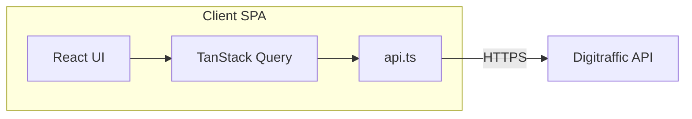

# Train Punctuality Tracker – Technical Solutions Spec

## Overview & references

This document describes **how** to implement the Train Punctuality Tracker: tech stack, architecture, data flow, API usage, deployment, and testing. It does not repeat product or UX requirements; those are defined in the functional and visual specifications.

**Functional specification:** [FUNCTIONAL-SPEC.md](FUNCTIONAL-SPEC.md)  
**Visual specification:** [VISUAL-SPEC.md](VISUAL-SPEC.md)

The application is a client-only React SPA that tracks punctuality of two commuter trains (Lempäälä ↔ Tampere) using the Digitraffic Railway Traffic API. It provides summary statistics, a day-by-day timeline, and a sortable detail table. All behaviour and acceptance criteria are defined in the functional spec; visual design is in the visual spec. This document focuses on technical implementation.

---

## Tech stack

| Technology | Purpose |
| ---------- | ------- |
| **Vite** | Build tool and dev server |
| **React 18+** | UI framework |
| **TypeScript** | Typing and tooling |
| **Mantine** | UI components and theming. Use at least `@mantine/core` and `@mantine/dates` (for date inputs). Implement visual spec with Mantine components and theme. |
| **TanStack Query (React Query)** | Server state, caching, and data fetching for Digitraffic API |

- No backend; the app runs entirely in the browser and calls Digitraffic directly.
- Styling and layout follow the visual spec (colors, cards, table, timeline) using Mantine’s component library and theme (e.g. Mantine colors for green/yellow/red/gray status and orange/indigo gradients for train cards).

---

## Architecture



- **SPA**: Single-page application; no server-side rendering or API proxy.
- **Data flow**: User selects date range and clicks “Fetch” → a custom hook triggers one TanStack Query per `(date, trainNumber)` for each weekday in the range → for each (date, trainNumber): if date is **today**, always fetch from API; otherwise check **local storage** first; if data exists, use it and skip API; if not, call API → `api.ts` performs `GET https://rata.digitraffic.fi/api/v1/trains/{date}/{trainNumber}` when needed → responses are parsed into `TrainRecord` → successful results for **past dates only** are written to local storage → Query cache holds the data → Summary, Timeline, and Table views read from the same hook output.
- **State**: All Digitraffic-derived data is **server state** managed by TanStack Query, with **local storage** as a persistence layer for past dates. UI state (selected date range, active tab) stays in React state (e.g. `useState` in the top-level component or a small context if preferred).

---

## Data layer (TanStack Query)

### Query key design

Use a stable query key per train per date so cache is deduplicated and reusable:

```typescript
const trainQueryKey = (date: string, trainNumber: number) =>
  ['train', date, trainNumber] as const;
```

- **Example:** `['train', '2026-01-27', 1719]` for the morning train on that date.

### Batching and aggregation

- For a given date range (start, end), compute the list of **weekdays only** (functional spec: Monday–Friday, max 30 days, end date not in future).
- For each weekday and each train number (1719, 9700), either:
  - use **`useQueries`** to run multiple queries in parallel, or
  - use a single hook that calls `queryClient.fetchQuery` (or `prefetchQuery`) for each `(date, trainNumber)` when the user clicks “Fetch”.
- Show a **loading** state until all queries for the selected range have settled (success or skipped).
- **Aggregate** successful results: map each API response to one `TrainRecord` (see API integration below), collect into a single `TrainRecord[]`, sort by date (newest first) for the table. Return `{ data: TrainRecord[], isLoading, error }` from the hook (e.g. `useTrainData(startDate, endDate)`).
- **Cache and stale time**: Set `staleTime` (e.g. 5–15 minutes) so the same date/train is not re-fetched on every tab switch; historical data is effectively immutable.

### Local storage

- **Purpose**: Persist fetched train data in the browser so repeat visits or re-fetches for the same date range avoid unnecessary API calls.
- **Key format**: Use a stable key per (date, trainNumber), e.g. `train:{date}:{trainNumber}` (e.g. `train:2026-01-27:1719`). Store the parsed **TrainRecord** (or the raw API response if you parse on read) as JSON.
- **Read**: When resolving data for (date, trainNumber), if **date is not today** (compare as YYYY-MM-DD in Finnish timezone), check `localStorage.getItem(key)` first. If present and valid, use it and do not call the API. If **date is today**, skip local storage and always fetch from the API.
- **Write**: After a successful API fetch, parse to TrainRecord; then **only if date is not today**, call `localStorage.setItem(key, JSON.stringify(trainRecord))`. Never write today’s data to local storage.
- **Placement**: Implement the read/write in the same layer that triggers the API (e.g. inside the TanStack Query fetcher or in a thin wrapper around `fetchTrain`). The hook calls a function that: (1) if date === today → fetch from API, do not persist; (2) else check localStorage → if hit, return parsed data; (3) else fetch from API, then persist and return.

### Hook contract

- **`useTrainData(startDate: string, endDate: string)`** (or with an “enabled” flag so it only runs after “Fetch”):
  - **When it runs:** Queries run only when the user has triggered a fetch (e.g. Fetch clicked). Before that, return empty data; use an `enabled` option so TanStack Query does not run until fetch is requested.
  - **Input:** ISO date strings (YYYY-MM-DD), weekday-only, max 30 days, end not in future (validate in UI or hook).
  - **Output:** `{ data: TrainRecord[] | undefined, isLoading: boolean, error: Error | null }`.
  - **Internally:** TanStack Query (`useQueries` or `queryClient.fetchQuery`), local storage read/write per "Local storage" above, parse to `TrainRecord`, merge and sort by date (newest first).

---

## API integration

### API reference (Digitraffic Railway Traffic API)

- **Base URL:** `https://rata.digitraffic.fi/api/v1`
- **Endpoint:** `GET /trains/{departure_date}/{train_number}` (e.g. `GET /trains/2026-01-30/1719`)
- **Train numbers:** Morning 8:20 LPÄ→TPE: `1719`; Evening 16:35 TPE→LPÄ: `9700`
- **Station codes:** Lempäälä `LPÄ`, Tampere `TPE`
- **Response:** JSON array with a single train object. All times UTC; Finland is UTC+2/UTC+3. Historical data ~720 days.

```typescript
interface TrainResponse {
  trainNumber: number;
  departureDate: string;        // "YYYY-MM-DD"
  trainType: string;
  operatorShortCode: string;
  runningCurrently: boolean;
  cancelled: boolean;
  timeTableRows: TimeTableRow[];
}

interface TimeTableRow {
  stationShortCode: string;
  type: "DEPARTURE" | "ARRIVAL";
  scheduledTime: string;        // ISO 8601 UTC
  actualTime?: string;
  differenceInMinutes?: number; // positive = late
  commercialStop: boolean;
  cancelled: boolean;
}
```

**Example API calls:**

```bash
curl 'https://rata.digitraffic.fi/api/v1/trains/2026-01-30/1719' --compressed
curl 'https://rata.digitraffic.fi/api/v1/trains/2026-01-30/9700' --compressed
```

### Client

- **Single function** in `src/utils/api.ts`:  
  `fetchTrain(date: string, trainNumber: number): Promise<TrainResponse | null>`  
  - Calls `GET https://rata.digitraffic.fi/api/v1/trains/{date}/{trainNumber}`.
  - Returns the first element of the JSON array (one train per response), or `null` if the response is empty or the train is missing.
  - Throws on network errors or non-OK HTTP status so TanStack Query can treat them as errors and optionally retry.
- **Local storage** is not inside `fetchTrain`; the **caller** (e.g. the TanStack Query fetcher or a wrapper in the hook) is responsible for: (1) checking localStorage for past dates and returning early if data exists; (2) calling `fetchTrain` when no cached data or when date is today; (3) after a successful fetch, writing to localStorage only when date is not today (using a key like `train:{date}:{trainNumber}` and storing TrainRecord or raw response as JSON).

### Parsing to TrainRecord

- Map Digitraffic `TrainResponse` + `timeTableRows` to the functional spec’s **TrainRecord**:
  - Find the **departure** row: `type === "DEPARTURE"` and `stationShortCode === from` (LPÄ for 1719, TPE for 9700). Find the **arrival** row for the destination station.
  - **Delay:** Use `differenceInMinutes` from the departure row. If `differenceInMinutes` or `actualTime` is missing (e.g. train not yet departed), treat as `delayMinutes: 0` and derive status from that, or skip the record—document the choice. If train is cancelled (top-level or departure row), use status CANCELLED per functional spec.
- **Status classification** (functional spec):
  - `cancelled` → `CANCELLED`
  - else `delayMinutes <= 0` → `ON_TIME`
  - else `delayMinutes <= 5` → `SLIGHT_DELAY`
  - else → `DELAYED`
- Implement this parsing in a dedicated function (e.g. in `api.ts` or `utils/parseTrain.ts`) and reuse it wherever API response is turned into `TrainRecord`.

### Error handling

- **Per-query errors** (network failure, 5xx): Show an appropriate message in the UI; TanStack Query retry is optional (e.g. 1–2 retries).
- **Missing data**: If the API returns an empty array or no train for a date, treat as “no data” for that date/train (skip, do not fail the whole range). Do not show a fatal error for a single missing day.

---

## Project structure

Structure (aligned with functional spec; add TanStack Query, Mantine, and storage):

```
src/
├── components/
│   ├── DateRangePicker.tsx
│   ├── SummaryCard.tsx
│   ├── Timeline.tsx
│   ├── DataTable.tsx
│   └── TabNavigation.tsx
├── hooks/
│   └── useTrainData.ts
├── utils/
│   ├── api.ts
│   ├── dateUtils.ts
│   ├── statsCalculator.ts
│   ├── trainStorage.ts        (local storage read/write for past dates; key train:{date}:{trainNumber})
│   └── parseTrain.ts          (optional; can live in api.ts)
├── types/
│   └── train.ts
├── App.tsx
└── main.tsx                   (wrap app with MantineProvider, QueryClientProvider)
```

- **`src/types/train.ts`**: `TrainRecord`, `TrainResponse`, `TimeTableRow`, status type, and `TRAINS` config (from functional spec).
- **`src/utils/api.ts`**: `fetchTrain(date, trainNumber)`; optionally, mapping from API response to `TrainRecord` here or in a separate parser.
- **`src/utils/dateUtils.ts`**: Weekdays in range, Finnish date format (e.g. “ma 27.1.”), conversion from UTC to Finnish time (`Europe/Helsinki`) for display; also a helper for “is today” (YYYY-MM-DD in Finnish timezone) used by storage and fetcher.
- **`src/utils/trainStorage.ts`**: `getTrainFromStorage(date, trainNumber)` (returns `TrainRecord | null`, only for past dates); `setTrainInStorage(date, trainNumber, record)` (no-op when date is today). Key format: `train:{date}:{trainNumber}`. Used by the TanStack Query fetcher or hook before/after API calls.
- **`src/utils/statsCalculator.ts`**: Pure functions for summary stats. **`computeSummary(records: TrainRecord[])`** should return an object usable by SummaryCard, e.g. `{ onTimePercent, slightDelayPercent, delayedPercent, cancelledCount, averageDelay, totalCount }` where percentages use denominator `totalCount` (all records including cancelled), and `averageDelay` is the mean of `delayMinutes` over non-cancelled records only. Used by SummaryCard.
- **`src/hooks/useTrainData.ts`**: Takes date range; uses TanStack Query (e.g. `useQueries` or `queryClient.fetchQuery` with `trainQueryKey`); returns `{ data: TrainRecord[], isLoading, error }`.
- **Components**: SummaryCard, Timeline, DataTable, DateRangePicker, TabNavigation. They consume `useTrainData` (or receive `data`/`isLoading`/`error` from a parent that uses it) and use **Mantine** for layout and styling per [VISUAL-SPEC.md](VISUAL-SPEC.md).

---

## Deployment (Vercel)

- **Build**: Standard Vite build (`vite build`); output is static (e.g. `dist/`).
- **Vercel**: Connect the repo to Vercel; use default Vite preset. No environment variables required for the public Digitraffic API.
- **No server-side logic**: No API routes or serverless functions; the browser talks directly to Digitraffic.

---

## Testing

- **Framework**: Vitest + React Testing Library.
- **Utils**:
  - **`api.ts`**: Mock `fetch`; assert correct URL and that response is parsed (and that empty response yields `null` or is handled).
  - **`dateUtils.ts`**: Weekdays in range, Finnish date formatting, timezone conversion.
  - **`statsCalculator.ts`**: Given a small `TrainRecord[]`, assert correct percentages, counts, and average delay (and status classification if it lives there).
- **Components** (RTL):
  - **SummaryCard**: Given mock `TrainRecord[]` (or summary stats), assert correct labels and percentages.
  - **DataTable**: Sort order (newest first), formatted date and delay, status badges.
  - **DateRangePicker**: Min/max range, weekday-only behaviour if enforced in UI.
  - **Timeline**: Correct color per status (green/yellow/red/gray).
- **Hook** (optional): Test `useTrainData` with `QueryClientProvider` and mocked `fetchTrain` returning canned Digitraffic payloads; assert aggregated `TrainRecord[]` and loading/error states.
- **E2E**: Out of scope for this technical spec.

---

## Non-functional

- **Error handling**: Per-query errors surfaced in UI with a clear message; missing data for a single date does not break the whole range.
- **Loading UX**: Show a single loading indicator (spinner or skeleton) while any of the range queries are in flight; avoid layout shift.
- **Finnish timezone**: All user-visible times must be in `Europe/Helsinki` (e.g. via `Intl` or `dateUtils`); store and transmit UTC from the API as-is.
- **Responsiveness**: Layout works on mobile (stack summary cards, scrollable table/timeline) using Mantine’s responsive props or breakpoints; no horizontal scrolling of the page.

---

## Out of scope (technical spec)

- Backend, authentication, persistence, push notifications, real-time APIs (as in functional spec).
- Detailed UI/UX copy and pixel-perfect layout are in the functional and visual specs; this document references them for wording and visuals, implemented with Mantine.
